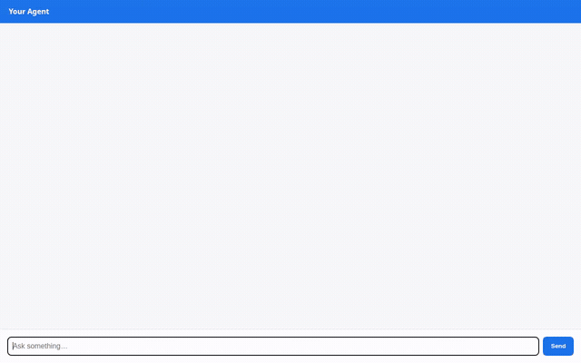

# 🍳 PantryChef

> **A conversational culinary AI agent that helps home cooks create delicious meals from ingredients on hand with a catalog of customizable recipes, dietary awareness, historical herbal knowledge, and precise scaling.**



---

## 🌟 Overview

**PantryChef** is an autonomous culinary assistant built on Google Cloud's Agent Platform and Google Agent Development Kit (ADK). By combining multi-turn conversational intelligence with deep tool integrations across Google Cloud, PantryChef transforms whatever ingredients you have in your fridge into satisfying, customized meals.

Whether accommodating strict dietary restrictions, scaling portions for a dinner party, consulting historical herbal wisdom, or generating photorealistic plating previews, PantryChef brings modern agentic AI into the kitchen.

---

## ✨ Key Features

- 🧠 **Cross-Session Memory**: Seamlessly remembers your dietary restrictions, allergies, cooking skill level, pantry staples, and favorite recipes across conversations.
- 🥘 **Smart Recipe Search & Catalog**: Queries and filters structured recipes by available ingredients and cuisine preferences.
- 🎨 **Rich A2UI Cards**: Renders interactive, beautifully formatted recipe cards with prep times, cook times, difficulty ratings, ingredient checklists, and step-by-step instructions.
- 📸 **Generative Dish Photography**: Generates appetizing, photorealistic plated dish imagery on demand using Gemini image models and serves them directly within recipe cards.
- ⚖️ **Sandbox Recipe Scaling & Math**: Safely executes Python code inside an isolated sandbox to recalculate ingredient quantities, adjust cooking durations, and calculate nutritional values for any serving size.
- 🌿 **Herbal Lore & Culinary RAG**: Grounded in Nicholas Culpeper's classic *Complete Herbal* via Vertex AI RAG Engine to offer traditional herb pairings, culinary history, and natural seasoning tips.
- 💬 **Cloud Run Chat Frontend**: Features an intuitive, responsive web chat interface with native client-side A2UI card rendering and A2A streaming.

---

## ☁️ Google Cloud & Agent Platform Stack

PantryChef integrates the full suite of Google Cloud Agent Platform capabilities:

| Google Cloud Tool | Usage in PantryChef |
| :--- | :--- |
| **Vertex AI Memory Bank** | Long-term cross-session memory powering `PreloadMemoryTool` and automated memory extraction callbacks for user preferences and dietary profiles. |
| **Cloud Firestore** | NoSQL document database managing the `recipes` collection, supporting querying by ingredients, retrieval by ID, and saving favorites. |
| **Google Cloud Storage (GCS)** | Object storage bucket (`pantry-chef-dishes-*`) storing generated recipe photos with public read access for inline web card rendering. |
| **Vertex AI RAG Engine** | Serverless RAG corpus indexing culinary herbal literature, queried through semantic vector search via a custom retrieval function tool. |
| **Gemini Image Generation** | Powered by `gemini-3.1-flash-lite-image` via global Vertex AI endpoints to create photorealistic images of prepared dishes. |
| **A2UI (Agent-to-User Interface)** | Built on A2UI schema v0.8 to emit structured UI components (`Card`, `Column`, `Text`, `Image`) rendered natively in the chat interface. |
| **Agent Engine Code Sandbox** | Secure runtime sandbox (`AgentEngineSandboxCodeExecutor`) running Python code for unit conversions, scaling ratios, and nutritional calculations. |
| **Google Cloud Run** | Serverless container deployment hosting the production FastAPI A2A proxy and chat UI. |

---

## 📁 Project Structure

```text
pantry-chef/
├── app/
│   ├── agent.py                 # Core PantryChef agent definition, tools, and callbacks
│   ├── a2ui_utils.py            # A2UI response post-processing & catalog integration
│   └── app_utils/               # Reasoning Engine runtime helpers
├── frontend/
│   ├── Dockerfile               # Production container definition for Cloud Run
│   ├── main.py                  # FastAPI A2A proxy connecting web clients to the agent
│   ├── requirements.txt         # Frontend dependencies (FastAPI, a2a-sdk, google-auth)
│   └── static/
│       └── index.html           # Web chat UI with embedded A2UI component renderer
├── scripts/
│   └── seed_firestore.py        # Seed script populating initial recipe catalog in Firestore
├── demo.gif                     # Looping demo animation showing agent in action
├── demo.webm                    # High-definition screen recording
├── agents-cli-manifest.yaml     # Agent Platform deployment metadata
└── pyproject.toml               # Python dependencies and project configuration
```

---

## 🚀 Getting Started

### Prerequisites

- Python 3.12+
- [`uv`](https://docs.astral.sh/uv/) package manager
- `google-agents-cli` (`uv tool install google-agents-cli`)
- `gcloud` CLI authenticated with Google Cloud Platform

### Local Development

1. **Install dependencies**:
   ```bash
   uv sync
   ```

2. **Seed the recipe database**:
   ```bash
   uv run python scripts/seed_firestore.py
   ```

3. **Launch the agent in ADK Playground**:
   ```bash
   uv run agents-cli playground
   ```
   Open `http://localhost:8000` to interact with the agent in the developer playground.

4. **Run the local chat frontend**:
   ```bash
   cd frontend
   uv run python main.py
   ```
   Open `http://localhost:8081` for the custom chat UI with native A2UI rendering.

---

## 🛠️ Run It Yourself

To deploy and run PantryChef in your own Google Cloud environment, please note that `PROJECT_ID`, the Cloud Storage bucket name (`pantry-chef-dishes-*`), and the Vertex AI RAG corpus resource name are hardcoded in the workshop implementation and must be replaced with your own GCP values across `app/agent.py`, `scripts/seed_firestore.py`, and `frontend/main.py`.

### High-Level Steps

1. **Seed Firestore**:
   Create a Firestore database in your GCP project and populate the initial recipe catalog:
   ```bash
   uv run python scripts/seed_firestore.py
   ```

2. **Create the RAG Corpus**:
   Set up a Vertex AI RAG Engine serverless corpus with your culinary/herbal documents (e.g. Culpeper's Herbal) and update the corpus resource name in `app/agent.py`.

3. **Deploy the Agent (`agents-cli deploy`)**:
   Deploy the backend agent to Vertex AI Reasoning Engine on Agent Platform:
   ```bash
   agents-cli deploy
   ```

4. **Deploy the Frontend to Cloud Run (`gcloud run deploy`)**:
   Deploy the containerized FastAPI proxy and chat interface:
   ```bash
   cd frontend
   gcloud run deploy pantry-chef-frontend \
     --source . \
     --region <your-region> \
     --set-env-vars AGENT_ENGINE_RESOURCE_NAME="<your-reasoning-engine-resource-name>",AGENT_DIRECTORY="app" \
     --allow-unauthenticated
   ```

---

## 🌐 Deployed Service

> [!NOTE]
> The live Cloud Run service and Agent Platform deployment referenced below were hosted in a temporary **Build with Gemini** workshop lab environment and are no longer live. Please refer to the **[demo GIF](#pantrychef)** at the top of this README as the interactive showcase of the agent in action!

- **Cloud Run Chat Interface**: `https://pantry-chef-frontend-629547557339.us-east1.run.app` *(offline / workshop lab concluded)*
- **Agent Platform Target**: Vertex AI Reasoning Engine (`us-east1`) over A2A protocol *(offline / workshop lab concluded)*
